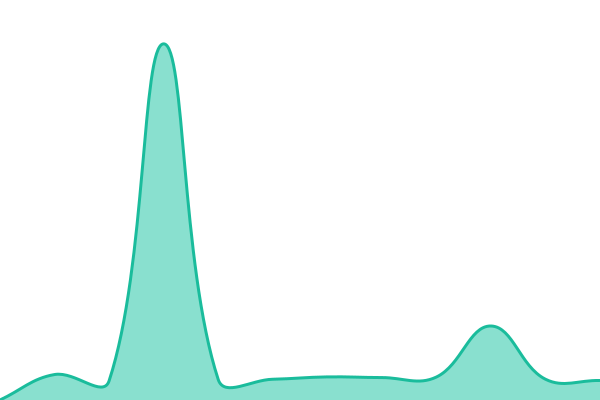
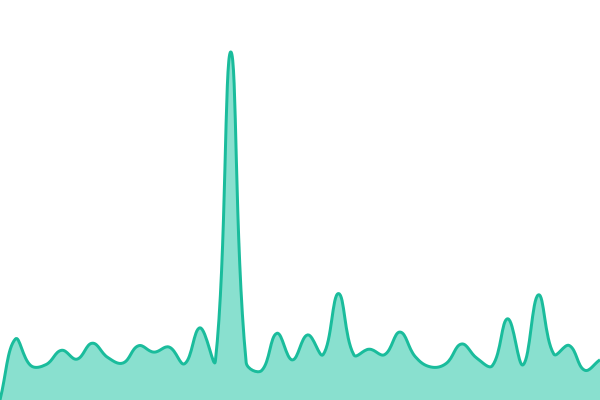
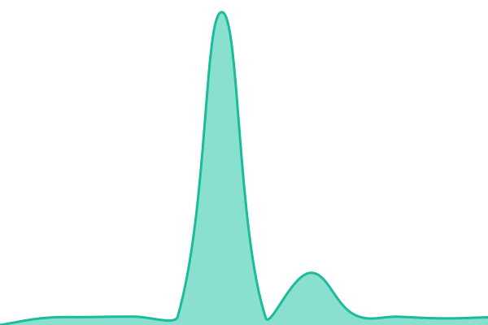
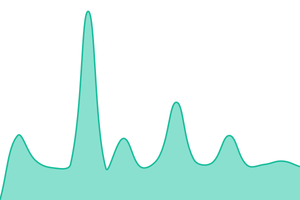
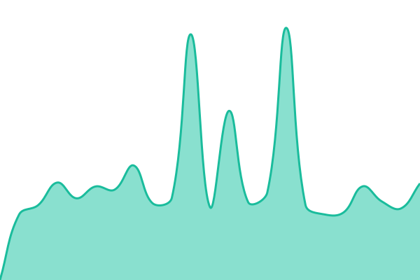

# [📈 Live Status](https://Lyra-Core.github.io/Status): <!--live status--> **🟩 All systems operational**

This repository contains the open-source uptime monitor and status page for [Lyra Core](https://Lyra-Core.github.io/Status), powered by [Upptime](https://github.com/upptime/upptime).

With [Upptime](https://upptime.js.org), you can get your own unlimited and free uptime monitor and status page, powered entirely by a GitHub repository. We use [Issues](https://github.com/Lyra-Core/Status/issues) as incident reports, [Actions](https://github.com/Lyra-Core/Status/actions) as uptime monitors, and [Pages](https://Lyra-Core.github.io/Status) for the status page.

<!--start: status pages-->
<!-- This summary is generated by Upptime (https://github.com/upptime/upptime) -->
<!-- Do not edit this manually, your changes will be overwritten -->
<!-- prettier-ignore -->
| URL | Status | History | Response Time | Uptime |
| --- | ------ | ------- | ------------- | ------ |
|  [Backend APIs](https://api.lyrawellbeing.health/status-0123456789abcdef) | 🟩 Up | [backend-ap-is.yml](https://github.com/Lyra-Core/Status/commits/HEAD/history/backend-ap-is.yml) | 

 193ms
     
 | 

<a href="https://status.lyrawellbeing.health/history/backend-ap-is">100.00%</a>
    

|  [Hub](https://app.lyrawellbeing.health) | 🟩 Up | [hub.yml](https://github.com/Lyra-Core/Status/commits/HEAD/history/hub.yml) | 

 497ms
     
 | 

<a href="https://status.lyrawellbeing.health/history/hub">100.00%</a>
    

|  [Portal](https://portal.lyrawellbeing.health) | 🟩 Up | [portal.yml](https://github.com/Lyra-Core/Status/commits/HEAD/history/portal.yml) | 

 663ms
     
 | 

<a href="https://status.lyrawellbeing.health/history/portal">100.00%</a>
    

|  [Schweiz Chat](https://lyrawellbeing.help/) | 🟩 Up | [schweiz-chat.yml](https://github.com/Lyra-Core/Status/commits/HEAD/history/schweiz-chat.yml) | 

 2189ms
     
 | 

<a href="https://status.lyrawellbeing.health/history/schweiz-chat">100.00%</a>
    

|  [Zoho](https://salesiq.zoho.eu/icas/liveview) | 🟩 Up | [zoho.yml](https://github.com/Lyra-Core/Status/commits/HEAD/history/zoho.yml) | 

 1303ms
     
 | 

<a href="https://status.lyrawellbeing.health/history/zoho">100.00%</a>
    

|  [Argentina Website](https://lyrawellbeing.ar) | 🟩 Up | [argentina-website.yml](https://github.com/Lyra-Core/Status/commits/HEAD/history/argentina-website.yml) | 

 3245ms
     
 | 

<a href="https://status.lyrawellbeing.health/history/argentina-website">93.57%</a>
    

|  [Austria Website](https://lyrawellbeing.at) | 🟩 Up | [austria-website.yml](https://github.com/Lyra-Core/Status/commits/HEAD/history/austria-website.yml) | 

 270ms
     
 | 

<a href="https://status.lyrawellbeing.health/history/austria-website">100.00%</a>
    

|  [Belgium Website](https://lyra-wellbeing.be/) | 🟩 Up | [belgium-website.yml](https://github.com/Lyra-Core/Status/commits/HEAD/history/belgium-website.yml) | 

 1514ms
     
 | 

<a href="https://status.lyrawellbeing.health/history/belgium-website">100.00%</a>
    

|  [Canada Website](https://lyrawellbeing.ca) | 🟩 Up | [canada-website.yml](https://github.com/Lyra-Core/Status/commits/HEAD/history/canada-website.yml) | 

 761ms
     
 | 

<a href="https://status.lyrawellbeing.health/history/canada-website">100.00%</a>
    

|  [France Website](https://lyrawellbeing.fr) | 🟩 Up | [france-website.yml](https://github.com/Lyra-Core/Status/commits/HEAD/history/france-website.yml) | 

 3046ms
     
 | 

<a href="https://status.lyrawellbeing.health/history/france-website">86.58%</a>
    

|  [Germany Website](https://lyrawellbeing.de) | 🟩 Up | [germany-website.yml](https://github.com/Lyra-Core/Status/commits/HEAD/history/germany-website.yml) | 

 3670ms
     
 | 

<a href="https://status.lyrawellbeing.health/history/germany-website">98.96%</a>
    

|  [Hungary Website](https://lyrawellbeing.hu) | 🟩 Up | [hungary-website.yml](https://github.com/Lyra-Core/Status/commits/HEAD/history/hungary-website.yml) | 

 1230ms
     
 | 

<a href="https://status.lyrawellbeing.health/history/hungary-website">100.00%</a>
    

|  [India Website](https://lyrawellbeing.in) | 🟩 Up | [india-website.yml](https://github.com/Lyra-Core/Status/commits/HEAD/history/india-website.yml) | 

 6073ms
     
 | 

<a href="https://status.lyrawellbeing.health/history/india-website">100.00%</a>
    

|  [International Website](https://lyrahealthinternational.com) | 🟩 Up | [international-website.yml](https://github.com/Lyra-Core/Status/commits/HEAD/history/international-website.yml) | 

 1432ms
     
 | 

<a href="https://status.lyrawellbeing.health/history/international-website">100.00%</a>
    

|  [Italy Website](https://lyrawellbeing.it) | 🟩 Up | [italy-website.yml](https://github.com/Lyra-Core/Status/commits/HEAD/history/italy-website.yml) | 

 2318ms
     
 | 

<a href="https://status.lyrawellbeing.health/history/italy-website">100.00%</a>
    

|  [Kenya Website](https://lyrawellbeing.co.ke) | 🟩 Up | [kenya-website.yml](https://github.com/Lyra-Core/Status/commits/HEAD/history/kenya-website.yml) | 

 1010ms
     
 | 

<a href="https://status.lyrawellbeing.health/history/kenya-website">100.00%</a>
    

|  [Luxembourg Website](https://lyrawellbeing.lu) | 🟩 Up | [luxembourg-website.yml](https://github.com/Lyra-Core/Status/commits/HEAD/history/luxembourg-website.yml) | 

 2962ms
     
 | 

<a href="https://status.lyrawellbeing.health/history/luxembourg-website">99.34%</a>
    

|  [Malaysia Website](https://lyrawellbeing.my) | 🟩 Up | [malaysia-website.yml](https://github.com/Lyra-Core/Status/commits/HEAD/history/malaysia-website.yml) | 

 1321ms
     
 | 

<a href="https://status.lyrawellbeing.health/history/malaysia-website">100.00%</a>
    

|  [Mexico Website](https://lyrawellbeing.com.mx) | 🟩 Up | [mexico-website.yml](https://github.com/Lyra-Core/Status/commits/HEAD/history/mexico-website.yml) | 

 1413ms
     
 | 

<a href="https://status.lyrawellbeing.health/history/mexico-website">100.00%</a>
    

|  [Netherlands Website](https://lyrawellbeing.nl) | 🟩 Up | [netherlands-website.yml](https://github.com/Lyra-Core/Status/commits/HEAD/history/netherlands-website.yml) | 

 358ms
     
 | 

<a href="https://status.lyrawellbeing.health/history/netherlands-website">100.00%</a>
    

|  [Portugal Website](https://lyrawellbeing.pt) | 🟩 Up | [portugal-website.yml](https://github.com/Lyra-Core/Status/commits/HEAD/history/portugal-website.yml) | 

 731ms
     
 | 

<a href="https://status.lyrawellbeing.health/history/portugal-website">100.00%</a>
    

|  [Schweiz Website](https://lyrawellbeing.ch) | 🟩 Up | [schweiz-website.yml](https://github.com/Lyra-Core/Status/commits/HEAD/history/schweiz-website.yml) | 

 3461ms
     
 | 

<a href="https://status.lyrawellbeing.health/history/schweiz-website">72.04%</a>
    

|  [Singapore Website](https://lyrawellbeing.sg) | 🟩 Up | [singapore-website.yml](https://github.com/Lyra-Core/Status/commits/HEAD/history/singapore-website.yml) | 

 1884ms
     
 | 

<a href="https://status.lyrawellbeing.health/history/singapore-website">100.00%</a>
    

|  [South Africa Website](https://lyrawellbeing.co.za) | 🟩 Up | [south-africa-website.yml](https://github.com/Lyra-Core/Status/commits/HEAD/history/south-africa-website.yml) | 

 1319ms
     
 | 

<a href="https://status.lyrawellbeing.health/history/south-africa-website">100.00%</a>
    

|  [Spain Website](https://lyrawellbeing.es) | 🟩 Up | [spain-website.yml](https://github.com/Lyra-Core/Status/commits/HEAD/history/spain-website.yml) | 

 841ms
     
 | 

<a href="https://status.lyrawellbeing.health/history/spain-website">100.00%</a>
    

|  [United Arab Emirates Website](https://lyrawellbeing.ae) | 🟩 Up | [united-arab-emirates-website.yml](https://github.com/Lyra-Core/Status/commits/HEAD/history/united-arab-emirates-website.yml) | 

 1276ms
     
 | 

<a href="https://status.lyrawellbeing.health/history/united-arab-emirates-website">100.00%</a>
    

|  [United Kingdom Website](https://lyrawellbeing.uk) | 🟩 Up | [united-kingdom-website.yml](https://github.com/Lyra-Core/Status/commits/HEAD/history/united-kingdom-website.yml) | 

 135ms
     
 | 

<a href="https://status.lyrawellbeing.health/history/united-kingdom-website">100.00%</a>
    

<!--end: status pages-->

[**Visit our status website →**](https://Lyra-Core.github.io/Status)

## 📄 License

- Powered by: [Upptime](https://github.com/upptime/upptime)
- Code: [MIT](./LICENSE) © [Anand Chowdhary](https://anandchowdhary.com), supported by [Pabio](https://pabio.com)
- Data in the `./history` directory: [Open Database License](https://opendatacommons.org/licenses/odbl/1-0/)
